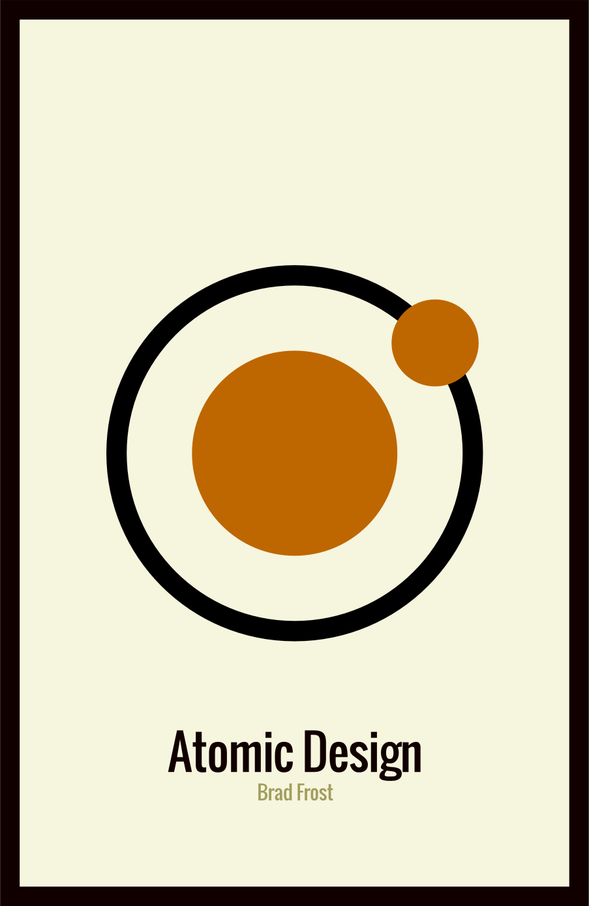
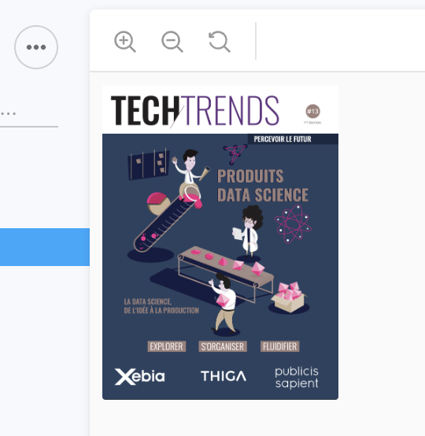
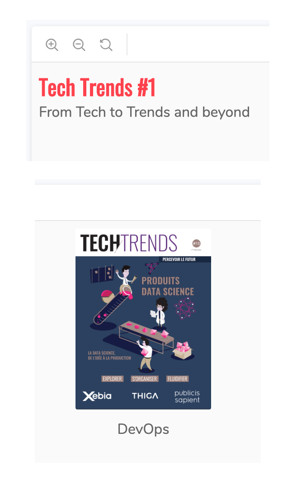
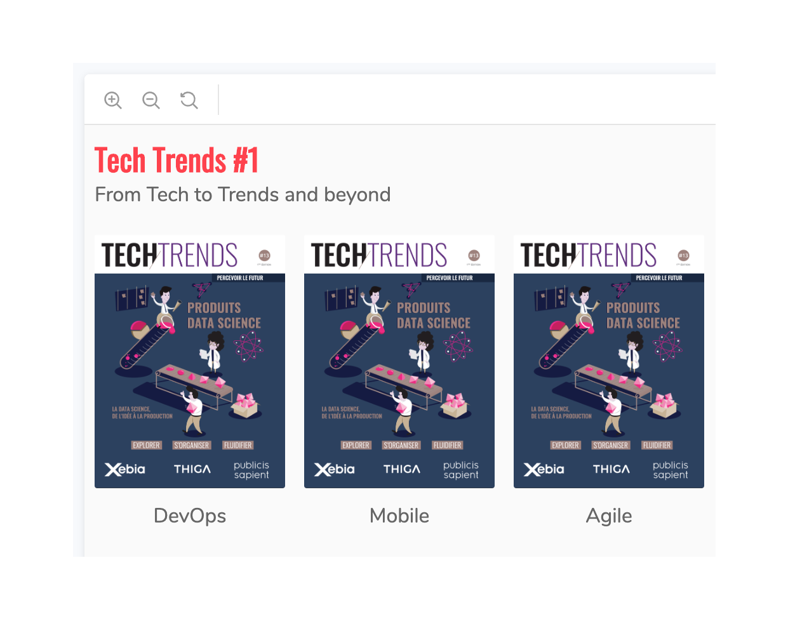
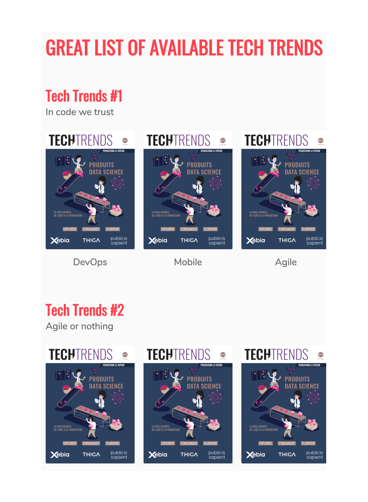

theme: XebiCon19
slidenumbers: true

# Atomic Design Driven Development

[.slidenumbers: false]
[.footer-style: #fff, alignment(right)]
[.footer: XebiCon19 | @XebiConFr | #XebiCon19]

---

[.header: #595959, alignment(left), line-height(1), Oswald]
[.footer-style: #fff, alignment(left)]
[.footer: @benjlacroix]

# Qui sommes-nous ?

*Benjamin* Lacroix
Développeur fullstack
6 ans à Xebia

--- 

[.header: #595959, alignment(left), line-height(1), Oswald]
[.footer-style: #fff, alignment(right)]
[.footer: @jsmadja]
[.slidenumbers: false]

# Qui sommes-nous ?

*Julien* Smadja
Développeur fullstack
9 ans à Xebia

---

[.header: #595959, alignment(left), line-height(1), Oswald]

# Plan

- Why
- How : *Atomic Design* à la rescousse
- What : *Atomiser* une app legacy
- *Atomic Design*, c'est bien

---

# Why

## Une vision atomique du design

---

[.header: #595959, alignment(left), line-height(1), Oswald]
[.slidenumbers: false]

# Constat Design

Le design par *page* n'a plus sa place

Ces dernières sont conçues via des *éléments d'interface* qui vont devoir s'intégrer dans des environnements *variées*

Atomic Design propose une approche par composants, expliqué en détails par *Brad Frost*

---

[.header: #595959, alignment(left), line-height(1), Oswald]

# Constat Tech

Une *page* nécessite des *données*, des *intéractions*, des *animations*, du *style*

*Concevoir* et *tester* une page est *compliqué* :

* états *multiples*
* *beaucoup* d'éléments imbriqués
* données API

---

> Arrêter de penser en *page* mais en un système de *composants* qui s'adaptent
> aux différents *supports*

---

[.header: #595959, alignment(left), line-height(1), Oswald]

# Atome

Element *indivisible* qui sert de *base* à d'autres composants. *Simple* et utilisé à *plusieurs* endroit
 
Example :

- Logo
- Image
- Texte

---

[.header: #595959, alignment(left), line-height(1), Oswald]

# Molécule

*Collections* d'atomes qui forment des composants un peu plus *complexes* 

Les molécules sont *sensible* à la *taille* des écrans
 
Example :

- label + champs de saisie + pictogramme loupe 🔍

---

[.header: #595959, alignment(left), line-height(1), Oswald]

# Organisme

Combinaison *complexe* de *molécules* et ou *d'atomes* qui forment un *partie* de l'interface *finale*
 
Example :

- Champs de recherche + navigation + logo = header 

---

[.header: #595959, alignment(left), line-height(1), Oswald]

# Template

Une *page*... sans *données*.

Le template contient des *organismes*, des *molécules* et des *atomes*.

C'est le *dernier* niveau qui est dans *Storybook*.

Example :

- Header + liste des catégories + footer

---

[.header: #595959, alignment(left), line-height(1), Oswald]

# Page

C'est le *template* remplis avec des *données* de l'*API*, la *navigation* entre les pages fonctionne.

C'est l'application *finale* visible par le *client*.

Cette partie n'est plus dans *Storybook*.

Elle est plus *difficile* à *tester* et le processus de *développement* est plus *long* que pour les éléments précédents.

---

---

[.header: #595959, alignment(left), line-height(1), Oswald]

# Découper pour mieux tester

*Découper* en *plusieurs* éléments des *avantages* :

- *Simplifier* les tests
- Obtenir des feedbacks *rapidement* et *régulièrement*
- *Documenter*
- *Accélérer* le développement
- *Partager* du *comportements* et du *style*

---

# Atomiser une app legacy

---

[.header: #595959, alignment(left), line-height(1), Oswald]

- *n* pages
- Du code *dupliqué*
- Responsabilités *multiples* :
    - *Appels* API
    - *Logique* métier dans la page
    - *Routing*
- Développement *fastidieux* :
    - *Retour* à l'état précédent à chaque *rafraîchissement*

---

# Baby steps

---

1. Choisir une *page*
1. Ajouter *Storybook* au projet
1. *Décomposer* la page
1. *Extraire* les composants
    1. D'abord les *atomes*
    1. Puis les *molécules*...
1. *Remonter* tous les appels *API* dans la page
1. S'*attaquer* à une autre page et utiliser les composants déjà *découpés*

---

[.header: #595959, alignment(left), line-height(1), Oswald]

# Conclusion

- Même sur un projet *legacy*
- *Découpage*
- *Documentation*
- *Efficacité*
- *Testabilité*

---

[.text: #595959, alignment(center), Nunito]
[.text-strong: #fe414d]
[.header: #fe414d]

# [fit] XEBICON**19**

La vidéo de cette conférence
sera prochainement sur **xebicon.fr**

Pour en être informé, restez connecté à **@Xebiconfr**

*Merci à nos sponsors*

  

