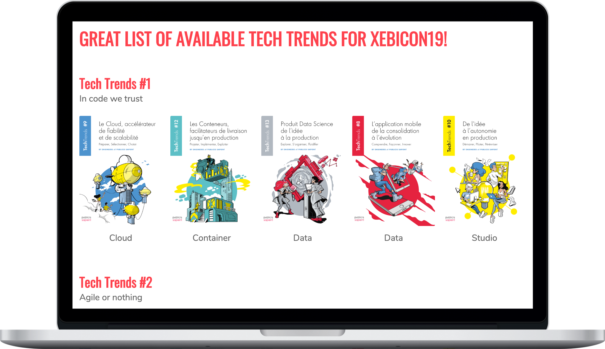
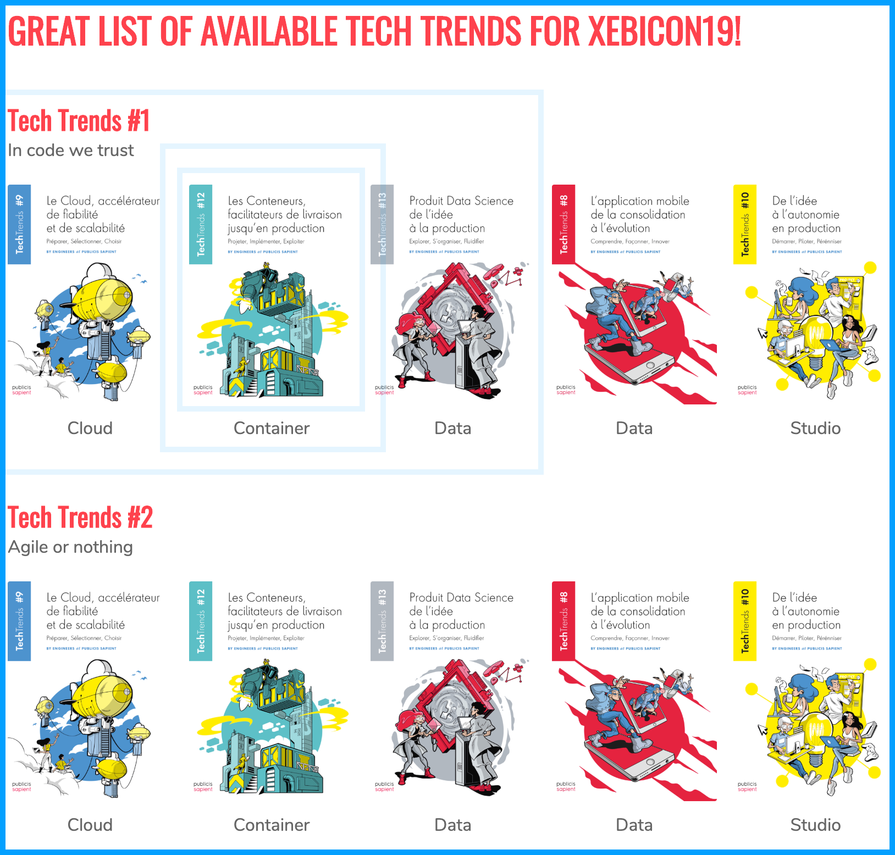
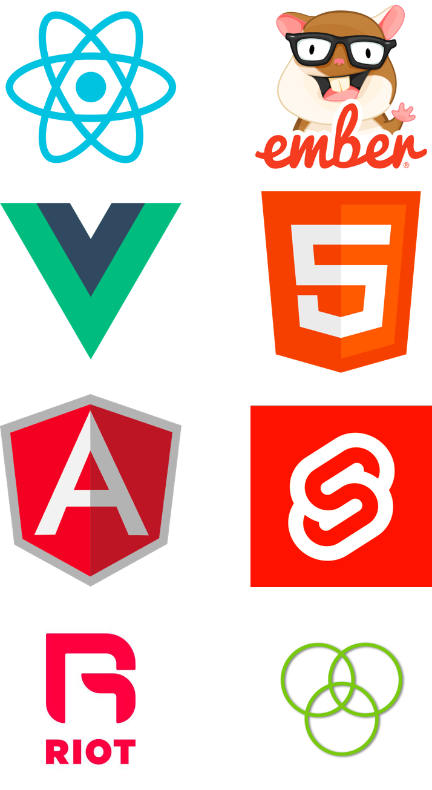

theme: XebiCon19
slidenumbers: true
slide-dividers: #
footer: XEBICON*19*
slide-transition: true

# Atomic Design Driven Development


[.header: #000, alignment(left), line-height(1.0), text-scale(1.4), Roboto Black]

[.slidenumbers: false]

[.footer-style: #000, alignment(left), text-scale(1.5)]

^
B

# Benjamin Lacroix


Développeur fullstack à Xebia depuis 6 ans

Adepte de l'Atomic Design ⚛︎ from scratch

*@benjlacroix*

[.footer-style: alignment(right), text-scale(1.6 )]

^
B

# Julien Smadja


Développeur fullstack à Xebia depuis 9 ans

Adepte de l'Atomic Design ⚛︎ sur des projets legacy

*jsmadja*

[.slidenumbers: false]

^
J

# Plan

- Why
- How : *Atomic Design* à la rescousse
- What : *Atomiser* une app legacy
- *Atomic Design*, c'est bien

^
J

# Why

## Une vision<br/>atomique du design


[.background-color: #099fff]

[.header: #fff, alignment(left), Roboto Black]

[.footer-style: #fff, alignment(left), text-scale(1.8), Roboto Light]

[.footer: XEBICON**19**]

[.slidenumbers: false]

^
B

# Constat Design


Le design par *page* n'a plus sa place

Ces dernières sont conçues via des *éléments d'interface* qui vont devoir s'intégrer dans des environnements *variées*

Atomic Design propose une approche par composants, expliqué en détails par *Brad Frost*

[.slidenumbers: false]

^
B

# Constat Tech

Une *page* nécessite des *données*, des *intéractions*, des *animations*, du *style*

*Concevoir* et *tester* une page est *compliqué* :

* états *multiples*
* *beaucoup* d'éléments imbriqués
* données API

^
B

---

[.background-color: #e94552]

[.text: #fff, alignment(center), Roboto Light]

[.header: #fff, alignment(left), Roboto Black]

[.footer-style: #fff, alignment(left), text-scale(1.8), Roboto Light]

[.footer: XEBICON**19**]

[.slidenumbers: false]

> Arrêter de penser en **page** mais en un système de **composants** qui s'adaptent
> aux différents **supports**

^
J

# Démo

## Website des *TechTrends 2019*



# Atome


Element *indivisible* qui sert de *base* à d'autres composants.
*Simple* et utilisé à *plusieurs* endroit.
<br/>
Exemples :

- Logo
- Image
- Texte

^
J

# Atome

[.code-highlight: 2]

```html
<template>
  
</template>
```

^
J

# Molécule


*Collection* d'atomes qui forment des composants un peu plus *complexes* 

Les molécules sont *sensibles* à la *taille* des écrans
<br/>
Exemple :

- photo + titre

^
B

# Molécule

[.code-highlight: 3-6]

[.code-highlight: 7-9]

[.code-highlight: 2-10]

```html
<template>
  <div class="tt-with-title">
    <TechTrendImage 
      class="tt-with-title__image"
      :src="image.src"
      :alt="image.alt"/>
    <p class="tt-with-title__title">
      <slot></slot>
    </p>
  </div>
</template>
```

^
B

# Organisme


Combinaison *complexe* de *molécules* et ou *d'atomes* qui forment un *partie* de l'interface *finale*
<br/>
Exemple :

- Plusieurs TT + titre de section = 1 catégorie de TT 

^
J

# Organisme

[.code-highlight: 3]

[.code-highlight: 5-10]

[.code-highlight: 2-12]

```html
<template>
  <section class="tt-category">
    <HeaderList :title="title" :subtitle="subtitle"/>
    <div class="tt-category__items">
      <TechTrendWithTitle
          class="tt-category__item"
          :image="tt.image"
          :key="tt.title"
          v-for="tt in techTrends">{{tt.title}}
      </TechTrendWithTitle>
    </div>
  </section>
</template>
```

^
J

# Template

[.hide-footer]



Une *page*... sans *données*.

Le template contient des *organismes*, des *molécules* et des *atomes*.

C'est le *dernier* niveau qui est dans *Storybook*.

Exemple :

- Catégories de TT + titre de page = Page complète présentant les TT.

^
B

# Template

[.code-highlight: 3-5]

[.code-highlight: 6-12]

[.code-highlight: 2-13]

```html
<template>
  <div class="discover-tts-template">
    <h1 class="discover-tts-template__title">
      Great list of available Tech Trends for XebiCon19!
    </h1>
    <TechTrendCategory
        class="discover-tts-template__category"
        :tech-trends="ttCategory.techTrends"
        :title="ttCategory.title"
        :subtitle="ttCategory.subtitle"
        :key="ttCategory.title"
        v-for="ttCategory in ttCategories"/>
  </div>
</template>
```

^
B

# Page

C'est le *template* rempli avec des *données* de l'*API*, la *navigation* entre les pages fonctionne.

C'est l'application *finale* visible par le *client*.

Cette partie n'est plus dans *Storybook*.

Elle est plus *difficile* à *tester* et le processus de *développement* est plus *long* que pour les éléments précédents.

^
J

# Page

[.code-highlight: 3]

```html
<template>
  <div class="app">
    <DiscoverTechTrendsTemplate :tt-categories="ttCategories"/>
  </div>
</template>
```

[.code-highlight: none]

[.code-highlight: 5-9]

[.code-highlight: 10-12]

```javascript
export default {
  components: {
    DiscoverTechTrendsTemplate
  },
  data() {
    return {
      ttCategories: [],
    };
  },
  async mounted() {
    this.ttCategories = await TtCategoryService.getTtCategories();
  }
}
```

^
J

# Storybook

## Démo


^
B
Bien montrer que le changement d'un atome a des impactes partout

# Storybook

[.code-highlight: 1]

[.code-highlight: 3-8]

```javascript
export default {title: 'Atoms/TechTrendImage'};

export const withImage = () => ({
  components: {TechTrendImage},
  template: `<TechTrendImage 
                src="http://image.png" 
                alt="image alt"/>`,
});
```

# Découper pour mieux tester

*Découper* en *plusieurs* éléments a des *avantages* :

- *Simplifier* les tests
- Obtenir des feedbacks *rapidement* et *régulièrement*
- *Documenter*
- *Accélérer* le développement
- *Partager* du *comportement* et du *style*

^
B

# Atomiser


- Le from scratch est une chance
- Travailler sur du Legacy est la réalité
- L'atomisation est possible

^
J

# *Xebi-Spoti* monolithe

```html
<template>
 <div class="discover-tts-template">
   <h1 class="discover-tts-template__title">Great list of available Tech Trends for XebiCon19!</h1>
   <div class="discover-tts-template__category" :key="ttCategory.title" v-for="ttCategory in ttCategories">
     <section class="tt-category">
       <div class="header-list">
         <h2 class="header-list__title">{{ttCategory.title}}</h2>
         <p class="header-list__subtitle">{{ttCategory.subtitle}}</p>
       </div>
       <div class="tt-category__items">
         <div class="tt-category__item" :key="tt.title" v-for="tt in ttCategory.techTrends">
           <div class="tt-with-title">
             <div class="tt-with-title__image">
               
             </div>
             <p class="tt-with-title__title">{{tt.title}}</p>
           </div>
         </div>
       </div>
     </section>
   </div>
 </div>
</template>
```

^
J

# *Xebi-Spoti* monolithe

```javascript
 import TtCategoryService from '../services/tt-categories.service';

 export default {
   name: 'MonoliticPage',
   components: { },
   data() {
     return {
       ttCategories: [],
     };
   },
   async mounted() {
     this.ttCategories = await TtCategoryService.getTtCategories();
   }
 }
```

^
J

# *Xebi-Spoti* monolithe

```css
.discover-tts-template .discover-tts-template__title {
  color: #FE414D;
  text-transform: uppercase;
  margin-bottom: 40px;
}

.discover-tts-template .discover-tts-template__category {
  margin-top: 50px;
}

.discover-tts-template .discover-tts-template__category:first-of-type {
  margin-top: 0;
}

.tt-category .tt-category__items {
  display: flex;
}

.tt-category .tt-category__item {
  margin-left: 15px;
}

.tt-category .tt-category__items {
  margin-top: 20px;
}

.tt-category .tt-category__item:first-of-type {
  margin-left: 0;
}

.tt-with-title {
  text-align: center;
  cursor: pointer;
}

.tt-with-title .tt-with-title__title {
  font-weight: 500;
  margin-top: 5px;
}

.tt-image {
  height: 200px;
  width: 150px;
  border-radius: 2px;
  transition: 200ms filter ease-out;
}
```

^
J

# *Xebi-Spoti* monolithe, chiffres

- *92* lignes
- *20* lignes de template *HTML*
- *13* lignes de script *JavaScript*
- *48* lignes de style *CSS*

^
J

# *Xebi-Spoti* constat

- *Aucun* composant *spécifique*
- Tout est *mélangé*
    - Les appels réseaux
    - Les styles de tous les composants
- *Difficile* de lire la *structure*
    - Des boucles dans tous les sens
    - Des indentations à 8 niveaux de profondeur 😱
    - Les classes CSS sont mélangées
- La *réutilisabilité* est *impossible* en l'état

[.text: #000, line-height(.5), Roboto Light]

[.text-emphasis: #e94552, Roboto Black]

^
J

# *Xebi-Spoti* migration

- Refactorer
    - *Extraire* des composants *réutilisables*
    - Détricoter les appels réseaux
- Documenter
    - Rendre visible la *bibliothèque de composants*
- Tester
- *Supprimer* les *duplications* entre les pages
- Du + petit vers le + grand : de l'atome vers le template

[.text: #000, line-height(.6), Roboto Light]

[.text-emphasis: #e94552, Roboto Black]

^
J

# Tester un atome

[.code-highlight: 1-2]

[.code-highlight: 3-5]

[.code-highlight: 6-8]

```javascript
describe('TechTrendImage', () => {
  it('should have src and an alt', () => {
    const wrapper = shallowMount(TechTrendImage, {
      propsData: {src: 'http://img.img', alt: 'img alt'},
    });
    const img = wrapper.find('img');
    expect(img.attributes().src).toBe('http://img.img');
    expect(img.attributes().alt).toBe('img alt');
  });
});
```

^
Vue
Jest
Comme pour atome, organisme, template.

# HowTo

1. Storybook
1. Identifier une page
    - Pas trop complexe
    - Commencer modestement
1. Identifier votre 1er atome
    - Élément indivisible
    - Peu paramétrable
1. Créer votre Story
1. Implémenter l'atome
1. Substituer l'atome dans la page
1. Tester (manuellement/visuellement)
1. Recommencer



[.text: #000, text-scale(.9), line-height(.7), Roboto Light]

[.hide-footer]

^
J

# Cycle d'atomisation

- TDD-like
- Boucle de feedback *rapide*
- Par *incrément*
- Éviter un effet tunnel
- Apporter de la *valeur rapidement*


^
B

# Cycle d'atomisation - *atome*


^
J

# Cycle d'atomisation - *molécule*


^
J

# Cycle d'atomisation - *organisme*


^
B

# Cycle d'atomisation - *conseils*

1. ⚠️ ça sera *long*, fallait pas rusher !
1. Procéder *pas à pas*
1. ⚠️ aux régressions
1. *Publiez* les modifications *souvent*, pensez au `git-bisect`
1. Admirez votre *Storybook* qui se construit progressivement
1. Profitez-en pour *renommer*, *assainir*, rendre *paramétrable* les composants
1. *Automatisez* les *tests* autant que possible

[.text: #000, text-scale(.9), line-height(.7), Roboto Light]

[.text-emphasis: #e94552, text-scale(.9), line-height(.7), Roboto Black]

[.hide-footer]

^
J

# Conclusion

- Même sur un projet *legacy*
- *Découpage*
- *Documentation*
- *Efficacité*
- *Testabilité*

^
J

# <br/><br/><br/><br/><br/><br/><br/><br/>Q & A

@XebiConFr
\#XebiCon19

## Merci


[.background-color: #e94552]

[.text: #fff, Roboto Light]

[.header: #fff, alignment(left), text-scale(1.1), Roboto Black]

[.footer-style: #fff, alignment(left), text-scale(1.6), Roboto Light]

[.slidenumber-style: #fff]

[.footer: XEBICON**19**]
